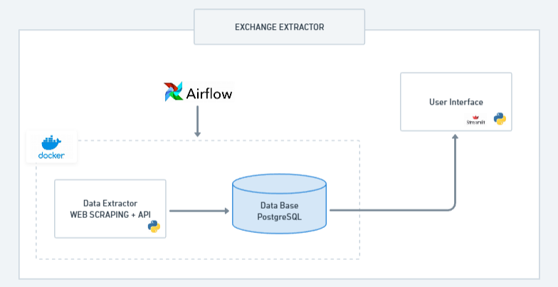

# 📊 **Extract-Exchange**

## 🛠️ Sobre

O **Extract-Exchange** é um projeto dedicado ao estudo de Engenharia de Dados. Ele fornece um ambiente robusto para coleta de dados por meio de APIs e Web Scraping, armazenamento dessas informações em um banco de dados PostgreSQL e exibição dos dados através de visualizações interativas. Utilizamos **Streamlit** para a demonstração das visualizações e **Airflow** para gerenciar e executar as pipelines.

O projeto foi criado seguindo boas praticas de programação, sendo completamente modularizado, cada recurso pode funcionar independete do outro. 

Para testar o resultado no streamlit sem precisar instalar o repositório, acesse: [https://view-exchange-tnthxryusub5cwfncvyhfn.streamlit.app/](https://view-exchange-tnthxryusub5cwfncvyhfn.streamlit.app/)

Siga as instruções para fazer o ambiente funcionar e se comunicar por completo.

## 🏗️ Arquitetura



### data_extractor:
Aplicação responsável por fazer a coleta de dados. O requeriments.txt possui apenas as configurações necessária para essa parte funcionar individualmente, você pode executar de forma independente utilizando as funções disponíveis no run.py de cada um dos extractors:

- general_information_extractor (Por Web Scraping)
- historic_extractor (Utiliza a API)
- real_time_extractor (Utiliza a API)

O Dockerfile é para colocar a aplicação em um container (é essencial para funcionar com o docker-compose, caso tente executar separadamente, é preciso configurar um banco de dados, a conexão é feita utilizando sqlalchemy e pode ser ajustada em data_extractor/db , a injeção de dados é individual para cada extractor, e deve ser configurada no repository disponível em data_extractor/nome_do_extractor/db )

#### Como os Dados São Coletados?

Os dados foram coletados de 2 formas:
- Por meio da API [yfinance](https://github.com/ranaroussi/yfinance) para coletar dados financeiros de empresas.

- Por meio de web scraping, que é realizado com `requests` para obter o HTML de [InfoMoney](https://www.infomoney.com.br/) e, em seguida, são realizadas operações com Regex para extrair os dados das empresas.

### data_visualize
O data_visualize permite ter uma visualização do dados, utilizando streamlit. Os dados foram salvos no formato parquet, o repository permite coletar os dados atuais do banco de dados para carregar. O requeriments.txt possui as configurações para que esse módulo possa funcionar individualmente. 

Já tem 3 arquivos parquet salvos no repositório para visualização caso não queira puxar do banco de dados.

Para executar o streamlit utilize:

```
streamlit run ./data_visualize/main.py
```

Por fim acesse a URL disponibilizada no terminal.


## 🔧 Configuração

### 0. Banco de Dados

O banco de dados é criado automaticamente ao executar o Docker Compose e é dividido em 3 tabelas:

- **tb_historic**: Armazena dados financeiros da empresa ao longo do tempo. 
- **tb_general_financials**: Armazena dados gerais da empresa ao longo do tempo. 
- **tb_real_time**: Armazena dados financeiros da empresa ao longo do dia, com intervalo de 1 minuto.  

```sql
CREATE TABLE IF NOT EXISTS tb_historic (
    id SERIAL PRIMARY KEY,
    date_information TIMESTAMP WITH TIME ZONE,
    open NUMERIC(14, 6),
    high NUMERIC(14, 6),
    low NUMERIC(14, 6),
    close NUMERIC(14, 6),
    volume BIGINT,
    dividends NUMERIC(14, 6),
    stock_splits NUMERIC(14, 6),
    company_code VARCHAR(10),
    CONSTRAINT unique_historic UNIQUE (date_information, open, high, low, close, volume, dividends, stock_splits, company_code)
);

CREATE TABLE IF NOT EXISTS tb_general_financials (
    id SERIAL PRIMARY KEY,
    company_code VARCHAR(10) NOT NULL,
    sector VARCHAR(50),
    net_sales NUMERIC(15, 2),
    net_income NUMERIC(15, 2),
    net_margin NUMERIC(5, 2),
    ebitda NUMERIC(15, 2),
    ebitda_margin NUMERIC(5, 2),
    total_assets NUMERIC(15, 2),
    gross_debt NUMERIC(15, 2),
    equity NUMERIC(15, 2),
    pe_ratio NUMERIC(5, 2),
    CONSTRAINT unique_company_code UNIQUE (company_code)
);

CREATE TABLE IF NOT EXISTS tb_real_time(
    id SERIAL PRIMARY KEY,
    company_code VARCHAR(10) NOT NULL,
    date_information TIMESTAMP,
    open NUMERIC(14, 6),
    high NUMERIC(14, 6),
    low NUMERIC(14, 6),
    close NUMERIC(14, 6),
    CONSTRAINT unique_real_time UNIQUE (company_code, date_information, open, high, low, close)
);
```
### 1. Configuração do Ambiente
Na raiz do projeto, execute o seguinte comando para criar e iniciar as imagens e containers Docker:

```
docker-compose up --build
```

Com isso, os serviços data_extractor e PostgreSQL estarão funcionando. É possível executar as pipelines manualmente com os seguintes comandos:

```
docker-compose run --rm app historic_extractor/run.py <CÓDIGO DA EMPRESA>

# Exemplo: Coleta dados da VALE3.SA para a tabela tb_historic
docker-compose run --rm app historic_extractor/run.py VALE3.SA
```

```
docker-compose run --rm app real_time_extractor/run.py <CÓDIGO DA EMPRESA>

# Exemplo: Coleta dados da VALE3.SA para a tabela tb_real_time
docker-compose run --rm app real_time_extractor/run.py VALE3.SA
```

```
docker-compose run --rm app general_information_extractor/run.py <LINK INFOMONEY DA EMPRESA> <CÓDIGO DA EMPRESA>
# Exemplo: Coleta dados da VALE3.SA para a tabela tb_general_financials
docker-compose run --rm app general_information_extractor/run.py https://www.infomoney.com.br/cotacoes/b3/acao/vale-vale3/ VALE3.SA
```

### 2. Configuração do Airflow

O Airflow é configurado localmente com o airflowctl. Para instalá-lo, para instalar, execute:

```
pip install airflowctl
```

```
airflowctl init airflow_project --build-start
```

Em seguida, mova o conteúdo do diretório dags-temp da raiz para o diretório airflow_project/dags:

- general_etl.py
- historic_etl.py
- real_time_etl.py

Por fim, acesse localhost:8080, faça login com o usuário e senha criados pelo Airflow (informados no terminal), e ative as DAGs para começar a execução.

Caso as Dags não apareçam, encerre o airflow para iniciar novamente:

```
airflowctl start airflow_project/
```
